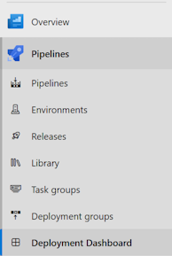
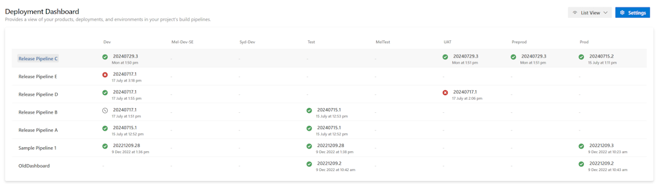
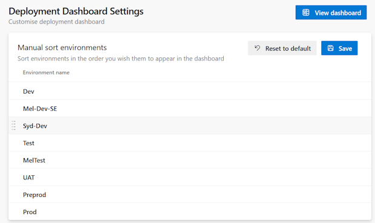

[?branchName=main)](https://dev.azure.com/sixpivot/ReleaseDashboard/_build/latest?definitionId=78&branchName=main)

# Introduction

An Azure DevOps extension that shows a Deployment Summary page within the Azure Pipelines hub.

See the extension in the Visual Studio Marketplace [here](https://marketplace.visualstudio.com/items?itemName=SixPivot.sixpivot-release-dashboard)

The extension adds a 'Deployment Dashboard' item to the Pipelines menu

Selecting this loads the Deployment Dashboard page (this may take a while depending on how many environments and deployments you have)

You can configure the extension via the Settings page, including reordering the environment. The default order is alphabetical, which can result in 'prod' appearing before 'test'!

You reorder the environments by dragging them up or down and clicking **Save**.

You can restore the default order by clicking **Reset to default**

## Contributing

Contributions are welcome. See our [Contribution guide](./CONTRIBUTING.md)

See [the developer guide](extension/DEV_GUIDE.md) to get started developing.
