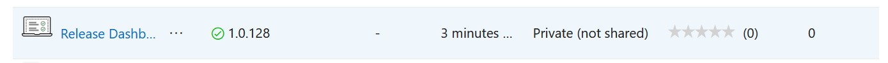
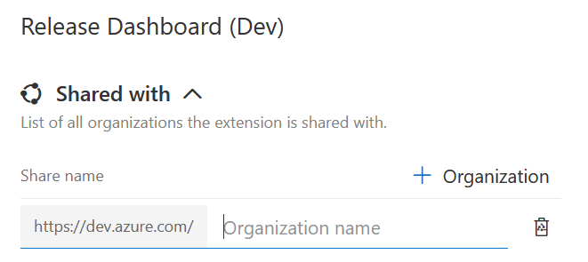
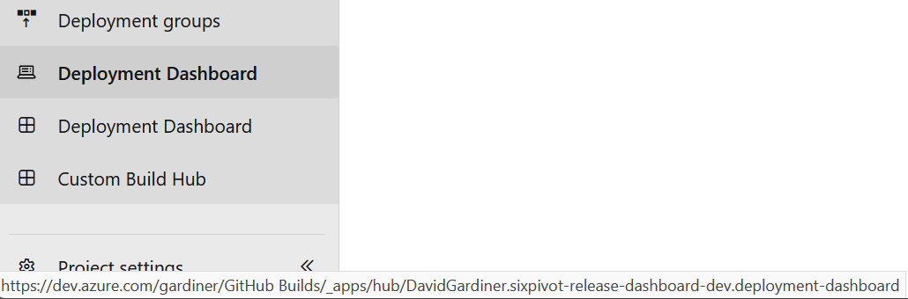

# Deployment Dashboard

Local development and debugging of the extension (except for the most simple changes) will generally require that you have access to an Azure DevOps organisation that you can publish your own 'dev' copy of the extension, which alters the baseUri to point to your local machine.

## Get started

1. Clone the repo
1. Copy `pre-commit` file from `git-hooks` folder to `.git\hooks`
1. `cd extensions` and `npm install`

## Publish a 'dev' extension to the marketplace

1. Go to <https://marketplace.visualstudio.com/>
1. Click **Publish extension** in the top right of the screen, and sign in (if you weren't already)
1. (Skip this step if you are a member of an existing marketplace publisher) If you have not been added to a publisher yet, you will go directly to a create screen.
   1. Create a new publisher, making note of the Publisher ID.
   1. Edit the `extension\configs\dev.json` file and update the **publisher** property, setting the value to your publisher id. Do not commit changes to this file!

1. Get an Azure DevOps PAT (personal access token) with the **Marketplace (Publish)** scope and access set to **All accessible organizations**. For more information, see [Authenticate access with personal access tokens](https://docs.microsoft.com/en-us/azure/devops/organizations/accounts/use-personal-access-tokens-to-authenticate).
1. Deploy the 'dev' extension to the marketplace: `npm run publish:dev -- --token [token]`
1. The extension will be built and uploaded to your publisher. You should now see it listed similar to this:

    

1. Click on the ellipsis ... menu and select **Share/Unshare**
1. In the side panel, click on **+Organization** and enter your Azure DevOps organisation name.

    

1. Now navigate back to your Azure DevOps organisation and go to **Organization settings**, then **Extensions** and **Shared**
1. Click on the **Release Dashboard (Dev)** extension and then **Install**
1. Follow the prompts to finish installing the extension into your organisation.

## Local development

1. `npm run start:dev`
1. Go to <localhost:3000> in your browser. You should get an untrusted certificate error page. Select **Advanced** and then select **Accept the Risk and Continue**.
1. In Azure DevOps, open a project and go to the **Azure Pipelines** section and click on the **Deployment Dashboard** item that links to a page ending in `sixpivot-release-dashboard-dev.deployment-dashboard` (Note the `-dev` in the name!)

    

1. You can now make local changes to the extension code. As this extension is pointing back to <https://localhost:3000> you should be ready to make changes to your code and see it hot-reload.

> Although most code changes will be reflected immediately, you may still need to occasionally update your extension in the marketplace. The dev extension loads all its resources from the webpack-dev-server, but the manifest itself is being loaded from the published code. Therefore, any changes to the manifest file will not be properly reflected in Azure DevOps until the extension has been republished.

### Debug in Visual Studio Code

1. In VS Code, press **F5** to start debugging (making sure the webpack-dev-server is still running). The default launch configuration should be set to ~~**Launch Firefox**~~ this should work now.

    > ~~Chrome configurations are included in the sample as well in case the Debugger for Chrome extension eventually supports iframes. However, debugging iframes is only supported in the Debugger for Firefox extension at this time.~~ this should work now.

1. Allow the `localhost:3000` certificate again and log into your Azure DevOps account.

    > If you leave the Firefox window open that VS Code launches, the debugger will reattach instead of starting a clean Firefox instance each time.

1. Navigate to your extension and set a breakpoint in a method in VS Code. You should see that breakpoint hit when that method executes.

## Unit tests

There are some (see [src/utilities.test.ts](src/utilities.test.ts) for an example), but it would be great to have more!

## Before committing code

Before committing your code. Run `npm run prettier:check` to validate the code with prettier. Either fix issues (error or warnings) manually or run `npm run prettier:write` to let prettier do the job for you. Please note that this could update files your didn't touch.

The pre-commit hook will prevent you from committing code if prettier encounters errors code.

## Developer resources

- [Miro board used for brainstorming](https://miro.com/app/board/uXjVP7LsQgA=/)
- Azure DevOps Extensions
  - [Azure DevOps Developer portal](https://developer.microsoft.com/en-gb/azure-devops/)
  - [Overview](https://learn.microsoft.com/azure/devops/extend/overview?toc=%2Fazure%2Fdevops%2Fmarketplace-extensibility%2Ftoc.json&view=azure-devops&WT.mc_id=DOP-MVP-5001655)
  - [Sample application](https://github.com/microsoft/azure-devops-extension-sample)
  - [Hot reload and debug](https://github.com/microsoft/azure-devops-extension-hot-reload-and-debug)
- [Scopes](https://github.com/MicrosoftDocs/azure-devops-docs/blob/main/docs/integrate/includes/scopes.md)
- [Extension API docs](https://learn.microsoft.com/en-us/javascript/api/azure-devops-extension-api/?WT.mc_id=DOP-MVP-5001655)
- Azure DevOps REST APIs
  - [Environments](https://learn.microsoft.com/rest/api/azure/devops/distributedtask/environments/list?view=azure-devops-rest-6.0&WT.mc_id=DOP-MVP-5001655) [Example](https://dev.azure.com/sixpivot/ReleaseDashboard/_apis/distributedtask/environments/5?api-version=6.0-preview.1)
  - [Environmentdeployment Records](https://learn.microsoft.com/en-us/rest/api/azure/devops/distributedtask/environmentdeployment-records?view=azure-devops-rest-6.0&WT.mc_id=DOP-MVP-5001655) [Example](https://dev.azure.com/sixpivot/ReleaseDashboard/_apis/distributedtask/environments/5/environmentdeploymentrecords?api-version=6.0-preview.1&top=1)
